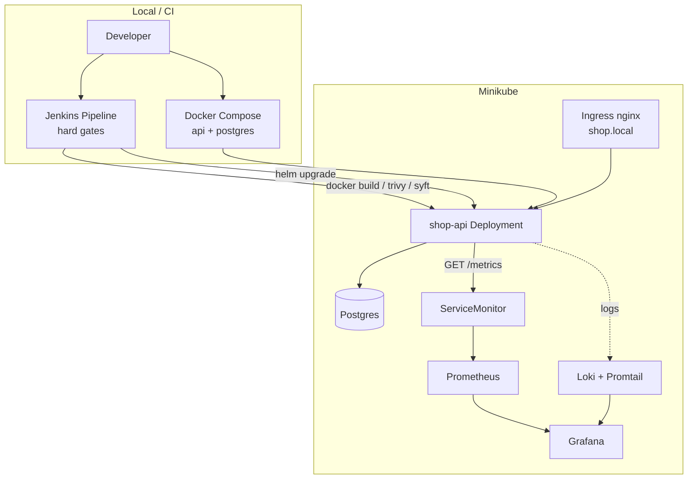

# FinalProject — Technion DevOps Final Project 15

**DevSecOps Pipeline with Full Security Scanning** — Flask shop API, SBOM/scan reports, Minikube Helm, Jenkins hard gates, and Prometheus/Grafana/Loki on Minikube.

| | |
|-|-|
| **Student** | Almog Rabinovich (`almog975`) |
| **Remote** | https://github.com/almog975/FinalProject |
| **Live demo** | **[`DEMO.md`](DEMO.md)** — copy-paste runbook for the grading defense |

---

## What we built (grading-oriented)

| Phase | Deliverable | Location |
|-------|-------------|----------|
| **1** | Flask shop API (products, cart, orders), Docker Compose, health/ready/metrics | [`devsecops-shop-app/`](devsecops-shop-app/) |
| **2** | SBOM + vulnerability scan-report endpoints (`/api/security/*`), samples + ingest | same app + `samples/` |
| **3** | Helm chart for Minikube (API + in-chart Postgres), Ingress `shop.local` | [`devsecops-shop-devops/helm/shop`](devsecops-shop-devops/helm/shop) |
| **4** | Jenkins declarative pipeline with **hard gates** (secrets / Trivy CRITICAL / Checkov HIGH / coverage ≥70%) | [`devsecops-shop-devops/jenkins/`](devsecops-shop-devops/jenkins/) *(PR `#4` until merged)* |
| **5** | Terraform (local, `enable_cloud=false`) + kube-prometheus-stack / Loki / Grafana dashboard | [`terraform/`](devsecops-shop-devops/terraform/), [`monitoring/`](devsecops-shop-devops/monitoring/) |
| **6** | Demo runbook + project overview (this README) | [`DEMO.md`](DEMO.md) |

---

## Architecture



**Request path (demo):** browser/curl → `shop.local` (Ingress) → shop-api → Postgres.  
**Observability:** shop-api exposes `GET /metrics` → scraped by Prometheus → Grafana dashboard *DevSecOps Shop API*.

---

## Repo layout

```
FinalProject/
  README.md                      # this file
  DEMO.md                        # Phase 6 presenter runbook
  scripts/demo.sh                # ordered demo command printer
  devsecops-shop-app/            # Phase 1–2 Flask API
    app/ Dockerfile docker-compose.yml samples/ tests/
  devsecops-shop-devops/         # Phase 3–5 (+ Phase 4 when merged)
    helm/shop/                   # Minikube chart + values-dev.yaml
    jenkins/                     # Jenkinsfile + helper scripts (Phase 4)
    security/                    # gitleaks / checkov / policies (Phase 4)
    newman/                      # Postman collection (Phase 4)
    terraform/                   # enable_cloud=false; enable_monitoring opt-in
    monitoring/                  # kube-prometheus-stack + Loki values + dashboard JSON
```

---

## Quick links by phase

- **Demo everything:** [`DEMO.md`](DEMO.md) · helper [`scripts/demo.sh`](scripts/demo.sh)
- **App (1–2):** [`devsecops-shop-app/README.md`](devsecops-shop-app/README.md)
- **DevOps overview (3 + 5):** [`devsecops-shop-devops/README.md`](devsecops-shop-devops/README.md)
- **Terraform:** [`devsecops-shop-devops/terraform/README.md`](devsecops-shop-devops/terraform/README.md)
- **Monitoring:** [`devsecops-shop-devops/monitoring/README.md`](devsecops-shop-devops/monitoring/README.md)
- **Hard gates (4):** `devsecops-shop-devops/security/policies/README.md` (on Phase 4 branch / after merge)

### One-liners (see DEMO for full sequences)

```bash
# Phase 1–2
cd devsecops-shop-app && cp -n .env.example .env && docker compose up --build

# Phase 3
minikube start --memory=4096 --cpus=2 && minikube addons enable ingress
# build/load shop-api:phase2, then:
helm upgrade --install shop ./devsecops-shop-devops/helm/shop \
  -f ./devsecops-shop-devops/helm/shop/values-dev.yaml -n shop --create-namespace

# Phase 5 (Helm path)
# → commands in DEMO.md / monitoring/README.md
# Grafana: kubectl -n monitoring port-forward svc/kube-prometheus-stack-grafana 3000:80
```

---

## Design choices (short)

- **In-chart Postgres** for Minikube demos (no Bitnami dependency / offline-friendly).
- **Security artifacts** resolve file → DB → bundled `samples/` so Compose demos work without CI.
- **Jenkins hard gates** fail the build on secrets, CRITICAL image CVEs, HIGH+ IaC, and coverage &lt; 70%.
- **Terraform defaults** never open a cloud bill (`enable_cloud=false`) and never write to the cluster until `enable_monitoring=true`.

---

## Out of scope

Multi-cloud deploy, Vault, paid APM, NetworkPolicy v1, new product features beyond the shop API.
